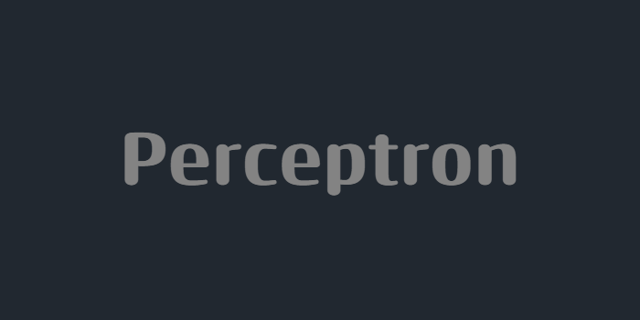

### This is a study-only repository, where I create a simple perceptron using C++ (no external libraries!)

## :construction: How to build
* Download source code [here](https://github.com/Darkx32/Perceptron/archive/refs/tags/v2.0.zip) and build using CMake
```bash
cmake .
cmake --build .
```
* To run just open "Perceptron" executable file
* For your enjoyment, change the values ​​and do whatever you want with the code, to learn how a simple AI works. :smile:
